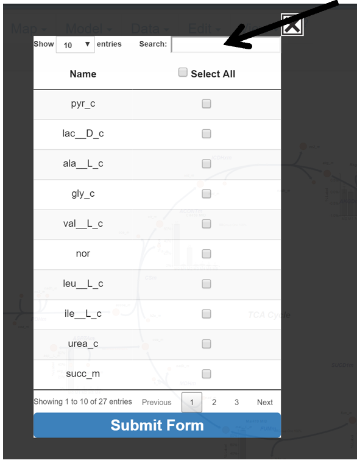
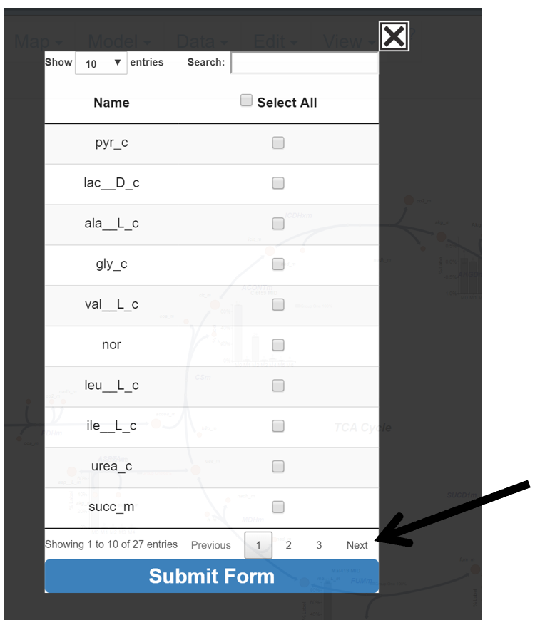
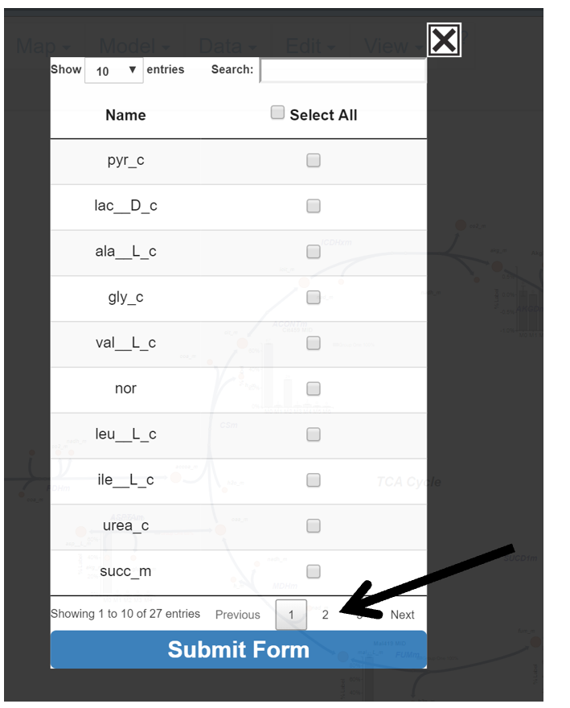
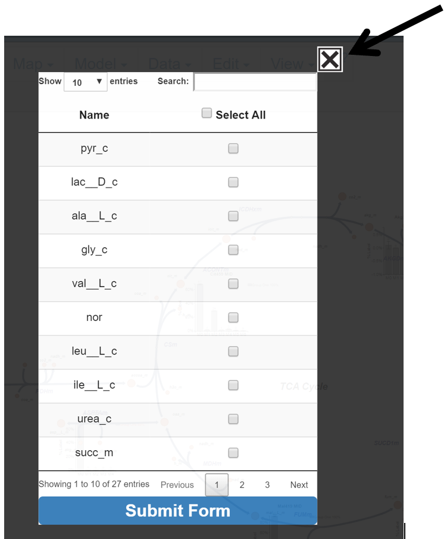

# <h2>5. Changing Data Displayed</h2>
This portion of the guide will explain how to edit the metabolite and isotopologue data that appears on the Escher Map.

## <h3>5.1 Metabolites to Display</h3>
This button allows the user to choose which metabolites will have data displayed on the Escher Map.

### <h3>5.1.0 Make the Metabolites to Display Pop-up Appear</h3>
Hover over the Metabolites to Display button and left click to make the selection appear.

{: style='width:200px' }

After click:

{: style='width:300px' }

After the Metabolite to Display pop-up appears, the user may begin selecting metabolites whose data they would like to have displayed on the Escher Map. 

### <h3>5.1.1 Functionality of Metabolites Selection</h3>
This section of the guide will explain how to select metabolites and different options the user has to find and make selections.

#### <h3>5.1.1.1 Entries Displayed</h3>
Change the number of entries displayed in the pop-up by clicking on the drop down menu in the top left and selecting a number.

{: style='width:300px' }
 
After Click:
 
{: style='width:300px' }
 
#### <h3>5.1.1.2 Search for Specific Metabolite</h3>
In the top right of the menu is a search bar. Click in the white box next to search and enter the name of the metabolite of interest. The table will automatically update search results with each entered character.

{: style='width:300px' }
 
After First Letter Typed:

{: style='width:300px' }
 
#### <h3>5.1.1.3 Select All</h3>
Click Select All to select all metabolites in the table.

{: style='width:300px' }
 
After Click:

{: style='width:300px' }
 
#### <h3>5.1.1.4 Moving Pages</h3>
Move through pages by clicking Next, Previous, or the Page Number.

Next:

{: style='width:300px' }
 
Previous: 

{: style='width:300px' }
 
Page Number:

{: style='width:300px' }
 
#### <h3>5.1.1.5 Submit or Abort Changes</h3>
When finished with selections click Submit Form, to abandon changes click the X in the top right corner.

Submit Changes:

{: style='width:300px' }

Before Submit:

{: style='width:600px' }

Only selected metabolites will be displayed on the Escher Map after submitting the table. 

After Submit:

{: style='width:600px' }

Abort Changes:

{: style='width:300px' }
 
## <h3>5.2 Isotopologues to Display</h3>
This button allows the user to limit the isotopologue range that will be included in graphs generated for each metabolite/fragment. The majority instructions for how to interact with the table can be found above in the Metabolites to Display section of the guide. The main difference is how to select the individual metabolite’s isotopologue limit. Rather than checking a box, the user must click a dropdown menu and select an isotopolgue which will be used as the upper range for the displayed isotopologues. For example, selecting M3 results in M0, M1, M2, M3 isotopologue data being included for graph of the selected metabolite/fragment. The default selection for all metabolites/fragments is all isotopologues included in the uploaded data file. The isotopologue will be applied to ALL graph types of the selected metabolite.

NOTE: The selected isotopologue limit is important for Mole Percent Enrichment calculations and graphs, as only isotopologues through the selected isotopologue are included in the enrichment calculation, and the selected isotopologue limit is assumed to be the total number of carbons in the selected metabolite/fragment. For example if M4 is selected for a fragment, Escher Trace assumes that there are 4 carbons in the metabolite and calculates the enrichment with this number.  

Hover over the Isotopologues to Display button and left click to make the selection appear.

{: style='width:200px' }

After click:

{: style='width:300px' }
 
To submit changes click submit form. 

Before Submit:

{: style='width:550px' }

After Submit:

{: style='width:550px' }
