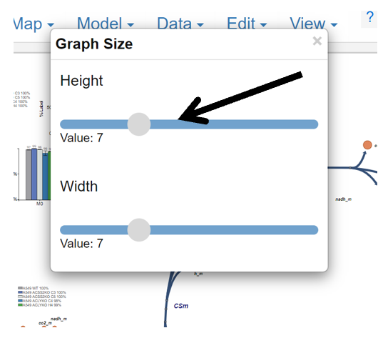
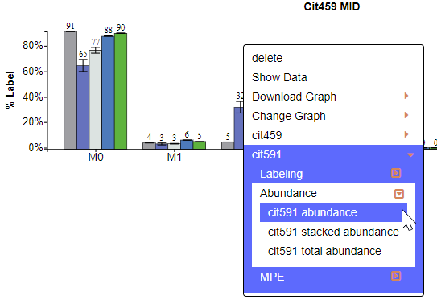

# 2. Edit Individual Graphs
Individual graphs generated by Escher Trace can be edited, downloaded, are used to access additional data associated with the graphed metabolite. You can change the title or the label on the left axis by clicking on either and typing the desired name. You can also get a separate graph of each individual isotopologue. This applies to all graphs available in the tool, not only the ones showed in this user guide.

## <h3>2.1	Right Click on Graphs</h3>
Right Clicking on graphs will make a dropdown menu appear that includes five options: Delete, Show Data, Download, Change Graph, and multiple fragments of the individual metabolite if applicable. These operations apply only to the graph/metabolite that was right clicked.

After Right Clicking on a graph:

{: style='width:500px' }
 
To get rid of the dropdown menu simply click away from the graph and menu.

## <h3>2.2	Delete Graph</h3>
To delete a graph, click on delete after making the dropdown menu appear.

{: style='width:500px' }
 
## <h3>2.3	Downloading an Individual Graph</h3>
After making the dropdown menu appear hover over download then select the file type you want to download the graph as, either SVG or PNG.
 
 {: style='width:500px' }
 
## <h3>2.4	Change the Graph Aesthetics</h3>
After hovering over Change Graph additional options will appear allowing you to change the  size and color scheme of the individual graph.

### <h3>2.4.1	Change Graph Size</h3>
Hover over Size and left click to make the Graph Size pop-up appear.

Interact with the Graph Size pop-up as described [here.](../GraphAttributes/#41-changing-size)

{: style='width:350px' }

### <h3>2.4.2	Change Graph Color Scheme</h3>
Hover over Color and left click to make the Color Scheme pop-up appear.

Interact with the Color Scheme pop-up as described [here.](../GraphAttributes/#421-selecting-the-graph-color-scheme)
 
## <h3>2.5	Access additional Graph Types for this Metabolite</h3>
The last option allows you to select a different graph type for specifically the selected metabolite. Simply hover over the metabolite/fragment name then click the desired graph type and that graph will appear.
Hovering:

{: style='width:500px' }
 
After Click:
 
 {: style='width:500px' }
 
## <h3>2.6	Show Data</h3>
Left click on Show Data to display the data used to generate the selected graph.

While Hovering:

{: style='width:500px' }
 
After Click:

 

Scroll through the data using the bar at the bottom of the table:

Copy the Table:

 
Close the Table: 
 

## <h3>2.7	Changing Graph Title or Y-axis Label</h3>
To edit the graph title or y-axis label of a graph, first: hover over the text and it will turn red, then left click.

Before Hover:

{: style='width:500px' }

After Hover:

{: style='width:500px' }

After Click:

{: style='width:500px' }
 
Change the text in the text input. Move through the text input with arrow keys and delete with backspace. When the desired name is entered press enter.

## <h3>2.8	Generating Graphs for Individual Isotopologues</h3>
If you want generate a graph of a specific isotopologue (e.g M0) click on the desired isotopologue on the x-axis, for M0 click M0.
NOTE: This option is only available for MID graphs.

When Hovering:

{: style='width:500px' }

After Click:
 
{: style='width:500px' }

## <h3>2.9	Moving the Graphs</h3>
To move the graphs simple hover over the graph click and hold then drag to desired location.
