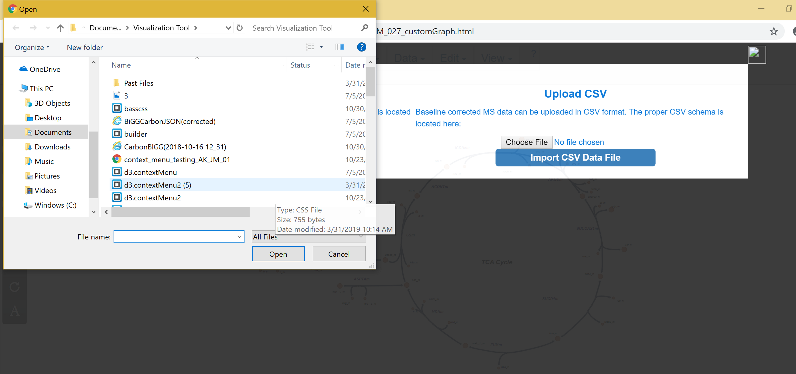
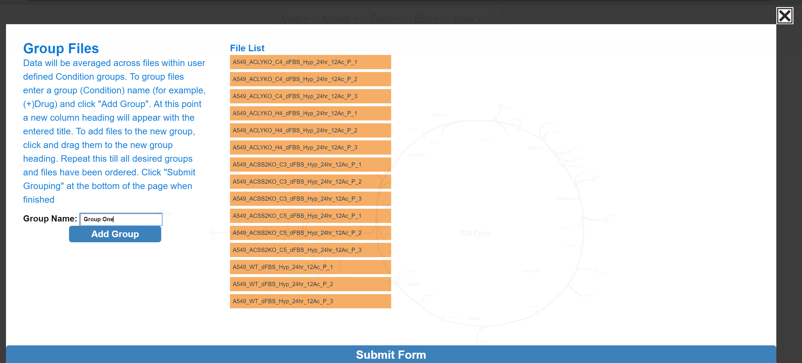
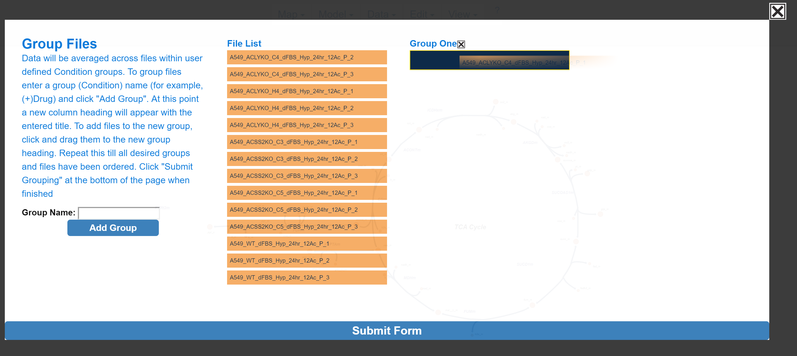
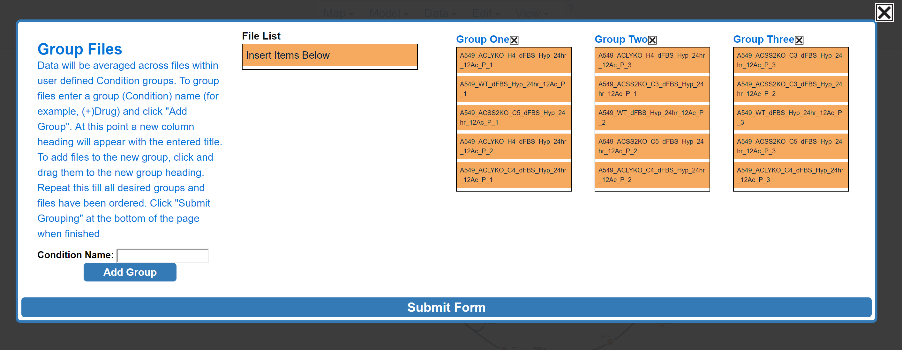
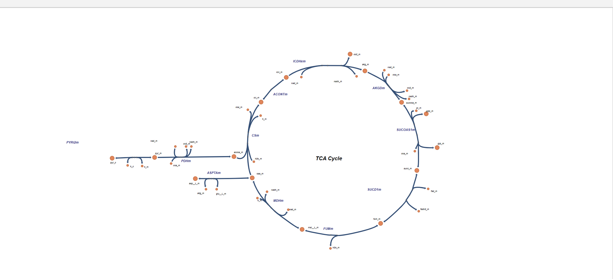
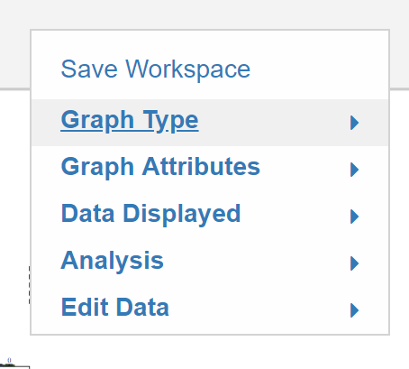

# 1. Getting Started
## <h3>1.1 Introduction</h3>
The goal of this visualization tool is to make 13C isotope tracing data more accessible by improving data presentation and streamlining analysis.
### <h3>1.1.1	What is isotope tracing?</h3>
Stable isotope tracing is a technique used to track the passage of an isotope through metabolic pathways in order to understand metabolic fluxes. By applying a stable isotope labeled metabolite to a cell or in vivo system, insight into how that metabolite is catabolized can be made by analyzing where the heavy isotopes go.
### <h3>1.1.2	What is Escher Trace?</h3>
Escher Trace simplifies the process of analyzing isotope tracing data by generating publication quality graphs of stable isotope tracing data on top of a metabolic map. Current features include:

- Upload data in a simple JSON or CSV format requiring only minor modifications to be made from mass spectrometer data sets
- Correct isotopic labeling for natural 13C abundance
- Automatically generate publication quality graphs of:
    - Mass isotopomer distribution
    - Metabolite abundance
    - Mole percent enrichment
    - Kinetic labeling and abundance   
- Export graphs in svg format, allowing for seamless integration with vector graphics editors (such as Adobe Illustrator).
- Full control over data normalization and sample/condition grouping
- Save and reload your workspace so you can start and stop analysis or easily transfer data to collaborators.
- Integration with Escher Maps, allowing for simple loading and editing of pathway maps.


## <h3>1.2	Metabolic Maps</h3>
The tool currently has maps for the TCA Cycle, Serine metabolism, and Branched Chain Amino Acid catabolism available. Other maps are available through the use of Escher, in order to understand how to get these maps use <a href="https://escher.readthedocs.io/en/stable/getting_started.html"> Escher Guide </a>   to import the desired map. Let us know which maps are needed here (make a link to a form of some sort) and we will work on adding it for you!

### <h3>1.2.1	Metabolic Map Editing</h3>
All of the changes to be made to the maps follow the same instructions as the Escher maps as they are the same, this set of dropdown menus at the top is where to start:


 
## <h3>1.3	Formatting Tracer Data</h3>
Uncorrected tracing data can be imported into Escher Trace in the following CSV format:

| Metabolite | Formula     | Fragment   | Sample 1 Name | Sample 2 Name | Sample 3 Name |
|------------|-------------|------------|----------|----------|----------|
| pyr_c      | C6H12O3N1Si | pyr174(M0) | 6.44E+04 | 6.22E+04 | 5.04E+04 |
|            |             | pyr175(M1) | 1.73E+04 | 1.67E+04 | 1.68E+04 |
|            |             | pyr176(M2) | 3.22E+04 | 2.99E+04 | 21802    |
|            |             | pyr177(M3) | 1.00E+06 | 9.75E+05 | 728237   |
| lac__D_c   | C10H25O2Si2 | lac233(M0) | 3.16E+05 | 2.76E+05 | 1.93E+05 |
|            |             | lac234(M1) | 189244   | 155819   | 126226   |
|            |             | lac235(M2) | 7073389  | 7.10E+06 | 5.09E+06 |
|            |             | lac236(M3) | 1.39E+06 | 1.39E+06 | 983949   |


NOTE 1: Natural isotope abundance correction is made by applying the algorithm introduced by Fernandez et. al (reference). 

NOTE 2: Chemical formulas must be entered in in empirical format, absent of any non alpha-numeric characters (such as "()", "{}", etc.).

NOTE 3: Isotopologue counts should be baseline corrected inorder to obtain accurate corrected labeling distributions

NOTE 4: If you intend to link data to a metabolite on an Escher Map, use a bigg_ID as the metabolite name

Tracing data that has been corrected for natural isotope abundance be imported into Escher Trace in the following CSV format:


To upload JSON data to Escher Trace, the JSON file must include two objects titled and formated as follows:

FileMIDs:

```javascript
"FileMIDs" : { "File1" : { "pyr_c": { "pyr174":{ "abundance":476460.5, "labeling":[{"fragment":"M0","frequency":0.944}, {"fragment":"M1","frequency":0.034}, {"fragment":"M2","frequency":0.012}, {"fragment":"M3","frequency":0.004} ] } }, "lac__D_c": { "lac233":{ "abundance":864278.5, "labeling": [ {"fragment":"M0","frequency":0.98}, {"fragment":"M1","frequency":0.013}, {"fragment":"M2","frequency":0.003} ] }, "lac261":{ "abundance":1445464.1, "labeling": [ {"fragment":"M0","frequency":0.981}, {"fragment":"M1","frequency":0.012}, {"fragment":"M2","frequency":0.005}, {"fragment":"M3","frequency":-0} ] } }, "ala__L_c": { "ala232":{ "abundance":3923111.375, "labeling": [ {"fragment":"M0","frequency":0.965}, {"fragment":"M1","frequency":0.034}, {"fragment":"M2","frequency":-0} ] }, "ala260":{ "abundance":3813437.875, "labeling": [ {"fragment":"M0","frequency":0.965}, {"fragment":"M1","frequency":0.027}, {"fragment":"M2","frequency":0.007}, {"fragment":"M3","frequency":0.001} ] } }, "gly_c": { "gly218":{ "abundance":7544461.55, "labeling": [ {"fragment":"M0","frequency":0.987}, {"fragment":"M1","frequency":0.012}, {"fragment":"M2","frequency":0}, {"fragment":"M3","frequency":0} ] }, "gly246":{ "abundance":7089519.95, "labeling": [ {"fragment":"M0","frequency":0.981}, {"fragment":"M1","frequency":0.018}, {"fragment":"M2","frequency":0}, {"fragment":"M3","frequency":0} ] } }, "val__L_c": { "val260":{ "abundance":1704688.1, "labeling": [ {"fragment":"M0","frequency":0.981}, {"fragment":"M1","frequency":0.012}, {"fragment":"M2","frequency":0.002}, {"fragment":"M3","frequency":0}, {"fragment":"M4","frequency":-0}, {"fragment":"M5","frequency":0.003} ] }, "val288":{ "abundance":1512721.8, "labeling": [ {"fragment":"M0","frequency":0.973}, {"fragment":"M1","frequency":-0}, {"fragment":"M2","frequency":0.002}, {"fragment":"M3","frequency":-0.001}, {"fragment":"M4","frequency":-0}, {"fragment":"M5","frequency":0.027} ] } }, "nor": { "nor260":{ "abundance":27916444.05, "labeling": [ {"fragment":"M0","frequency":0.971}, {"fragment":"M1","frequency":0.018}, {"fragment":"M2","frequency":0.003}, {"fragment":"M3","frequency":0.007}, {"fragment":"M4","frequency":0}, {"fragment":"M5","frequency":0.001} ] }, "nor288":{ "abundance":24849509, "labeling": [ {"fragment":"M0","frequency":0.989}, {"fragment":"M1","frequency":0.008}, {"fragment":"M2","frequency":0.003}, {"fragment":"M3","frequency":-0.001}, {"fragment":"M4","frequency":-0}, {"fragment":"M5","frequency":0} ] } }, "leu__L_c": { "leu274":{ "abundance":2002715.275, "labeling": [ {"fragment":"M0","frequency":0.992}, {"fragment":"M1","frequency":0.007}, {"fragment":"M2","frequency":-0.001}, {"fragment":"M3","frequency":0.001}, {"fragment":"M4","frequency":0}, {"fragment":"M5","frequency":0.001}, {"fragment":"M6","frequency":0} ] } }, "ile__L_c": { "ile200":{ "abundance":4874628, "labeling": [ {"fragment":"M0","frequency":0.995}, {"fragment":"M1","frequency":0}, {"fragment":"M2","frequency":0.003}, {"fragment":"M3","frequency":0.001}, {"fragment":"M4","frequency":0}, {"fragment":"M5","frequency":-0}, {"fragment":"M6","frequency":0} ] }, "ile274":{ "abundance":1861713.1, "labeling": [ {"fragment":"M0","frequency":0.99}, {"fragment":"M1","frequency":0.01}, {"fragment":"M2","frequency":-0}, {"fragment":"M3","frequency":0}, {"fragment":"M4","frequency":-0}, {"fragment":"M5","frequency":-0}, {"fragment":"M6","frequency":-0} ] } }, "urea_c": { "urea231":{ "abundance":500211.6, "labeling": [ {"fragment":"M0","frequency":0.614}, {"fragment":"M1","frequency":-0.001}, {"fragment":"M2","frequency":0.01}, {"fragment":"M3","frequency":0.407}, {"fragment":"M4","frequency":-0.006}, {"fragment":"M5","frequency":-0.025}, {"fragment":"M6","frequency":0.001} ] } }, "succ_m": { "suc289":{ "abundance":377352.85, "labeling": [ {"fragment":"M0","frequency":0.904}, {"fragment":"M1","frequency":0.029}, {"fragment":"M2","frequency":0.067}, {"fragment":"M3","frequency":0.003}, {"fragment":"M4","frequency":-0} ] } }, "ura": { "ura283":{ "abundance":3955451.875, "labeling": [ {"fragment":"M0","frequency":0.935}, {"fragment":"M1","frequency":0.039}, {"fragment":"M2","frequency":0.007}, {"fragment":"M3","frequency":0.001}, {"fragment":"M4","frequency":0.016} ] } }, "fum_m": { "fum287":{ "abundance":966552.7, "labeling": [ {"fragment":"M0","frequency":0.907}, {"fragment":"M1","frequency":0.043}, {"fragment":"M2","frequency":0.044}, {"fragment":"M3","frequency":0.001}, {"fragment":"M4","frequency":0.006} ] } }, "thym_c": { "thy297":{ "abundance":415365.725, "labeling": [ {"fragment":"M0","frequency":0.895}, {"fragment":"M1","frequency":0.017}, {"fragment":"M2","frequency":0.083}, {"fragment":"M3","frequency":0.001}, {"fragment":"M4","frequency":0.005}, {"fragment":"M5","frequency":-0}, {"fragment":"M6","frequency":-0.001}, {"fragment":"M7","frequency":0}, {"fragment":"M8","frequency":0}, {"fragment":"M9","frequency":-0}, {"fragment":"M10","frequency":-0} ] } }, "ser__L_c": { "ser288":{ "abundance":3027495.075, "labeling": [ {"fragment":"M0","frequency":0.964}, {"fragment":"M1","frequency":0.036}, {"fragment":"M2","frequency":-0.001}, {"fragment":"M3","frequency":0} ] }, "ser302":{ "abundance":1632243.9, "labeling": [ {"fragment":"M0","frequency":0.948}, {"fragment":"M1","frequency":0.019}, {"fragment":"M2","frequency":0.027}, {"fragment":"M3","frequency":0.004} ] }, "ser362":{ "abundance":2651559.6, "labeling": [ {"fragment":"M0","frequency":0.976}, {"fragment":"M1","frequency":0.025}, {"fragment":"M2","frequency":-0.003}, {"fragment":"M3","frequency":0.001} ] }, "ser390":{ "abundance":2981877.8, "labeling": [ {"fragment":"M0","frequency":0.966}, {"fragment":"M1","frequency":0.031}, {"fragment":"M2","frequency":0.005}, {"fragment":"M3","frequency":-0} ] } }, "thr__L_c": { "thr376":{ "abundance":146766.25, "labeling": [ {"fragment":"M0","frequency":0.991}, {"fragment":"M1","frequency":-0.006}, {"fragment":"M2","frequency":0.01}, {"fragment":"M3","frequency":-0.001}, {"fragment":"M4","frequency":-0.003} ] }, "thr404":{ "abundance":349435, "labeling": [ {"fragment":"M0","frequency":0.798}, {"fragment":"M1","frequency":-0.015}, {"fragment":"M2","frequency":0.212}, {"fragment":"M3","frequency":0.007}, {"fragment":"M4","frequency":-0.002}, {"fragment":"M5","frequency":0.002}, {"fragment":"M6","frequency":-0.001} ] } }, "met__L_c": { "met218":{ "abundance":645336.05, "labeling": [ {"fragment":"M0","frequency":0.944}, {"fragment":"M1","frequency":-0.004}, {"fragment":"M2","frequency":0.004}, {"fragment":"M3","frequency":0.021}, {"fragment":"M4","frequency":0.004}, {"fragment":"M5","frequency":0} ] }, "met320":{ "abundance":452575.5, "labeling": [ {"fragment":"M0","frequency":0.987}, {"fragment":"M1","frequency":0.004}, {"fragment":"M2","frequency":0.002}, {"fragment":"M3","frequency":0.003}, {"fragment":"M4","frequency":0.001}, {"fragment":"M5","frequency":0.002}, {"fragment":"M6","frequency":-0.001} ] } }, "akg_m": { "akg346":{ "abundance":991452.5, "labeling": [ {"fragment":"M0","frequency":0.883}, {"fragment":"M1","frequency":0.019}, {"fragment":"M2","frequency":0.096}, {"fragment":"M3","frequency":-0.001}, {"fragment":"M4","frequency":-0}, {"fragment":"M5","frequency":0.001} ] } }, "mal__L_m": { "mal419":{ "abundance":1953800.5, "labeling": [ {"fragment":"M0","frequency":0.9}, {"fragment":"M1","frequency":0.043}, {"fragment":"M2","frequency":0.057}, {"fragment":"M3","frequency":0}, {"fragment":"M4","frequency":0} ] } }, "phe__L_c": { "phe234":{ "abundance":1068246.375, "labeling": [ {"fragment":"M0","frequency":0.969}, {"fragment":"M1","frequency":0.017}, {"fragment":"M2","frequency":0.004}, {"fragment":"M3","frequency":0}, {"fragment":"M4","frequency":0.001}, {"fragment":"M5","frequency":0.002}, {"fragment":"M6","frequency":-0}, {"fragment":"M7","frequency":-0}, {"fragment":"M8","frequency":0.008} ] }, "phe302":{ "abundance":10174580.6, "labeling": [ {"fragment":"M0","frequency":0.937}, {"fragment":"M1","frequency":0.062}, {"fragment":"M2","frequency":0.001}, {"fragment":"M3","frequency":0.001} ] } }, "asp__L_m": { "asp302":{ "abundance":10860199.225, "labeling": [ {"fragment":"M0","frequency":0.877}, {"fragment":"M1","frequency":0.058}, {"fragment":"M2","frequency":0.001}, {"fragment":"M3","frequency":0.001}, {"fragment":"M4","frequency":0} ] }, "asp390":{ "abundance":3621224.55, "labeling": [ {"fragment":"M0","frequency":0.898}, {"fragment":"M1","frequency":0.065}, {"fragment":"M2","frequency":0.023}, {"fragment":"M3","frequency":-0}, {"fragment":"M4","frequency":-0} ] }, "asp418":{ "abundance":7332369.4, "labeling": [ {"fragment":"M0","frequency":0.909}, {"fragment":"M1","frequency":0.043}, {"fragment":"M2","frequency":0.05}, {"fragment":"M3","frequency":-0.002}, {"fragment":"M4","frequency":0} ] } }, "pro__L_c": { "pro258":{ "abundance":186387.25, "labeling": [ {"fragment":"M0","frequency":0.768}, {"fragment":"M1","frequency":0.03}, {"fragment":"M2","frequency":0.064}, {"fragment":"M3","frequency":-0.004}, {"fragment":"M4","frequency":-0.003} ] }, "pro330":{ "abundance":621510, "labeling": [ {"fragment":"M0","frequency":0.905}, {"fragment":"M1","frequency":-0.008}, {"fragment":"M2","frequency":0.077}, {"fragment":"M3","frequency":-0.002}, {"fragment":"M4","frequency":0.002} ] } }, "_2hg": { "_2hg433":{ "abundance":156711.825, "labeling": [ {"fragment":"M0","frequency":0.882}, {"fragment":"M1","frequency":-0.001}, {"fragment":"M2","frequency":0.101}, {"fragment":"M3","frequency":0.005}, {"fragment":"M4","frequency":-0.003}, {"fragment":"M5","frequency":-0.003} ] } }, "glu__L_m": { "glu330":{ "abundance":23598593.65, "labeling": [ {"fragment":"M0","frequency":0.881}, {"fragment":"M1","frequency":0.028}, {"fragment":"M2","frequency":0.09}, {"fragment":"M3","frequency":-0.001}, {"fragment":"M4","frequency":0} ] }, "glu432":{ "abundance":38867947.25, "labeling": [ {"fragment":"M0","frequency":0.87}, {"fragment":"M1","frequency":0.035}, {"fragment":"M2","frequency":0.097}, {"fragment":"M3","frequency":-0.002}, {"fragment":"M4","frequency":0}, {"fragment":"M5","frequency":0} ] } }, "lys__L_c": { "lys329":{ "abundance":369500.125, "labeling": [ {"fragment":"M0","frequency":0.956}, {"fragment":"M1","frequency":0.002}, {"fragment":"M2","frequency":0.003}, {"fragment":"M3","frequency":0.003}, {"fragment":"M4","frequency":0}, {"fragment":"M5","frequency":-0.001} ] }, "lys431":{ "abundance":351054.75, "labeling": [ {"fragment":"M0","frequency":0.844}, {"fragment":"M1","frequency":0.004}, {"fragment":"M2","frequency":0.004}, {"fragment":"M3","frequency":-0.001}, {"fragment":"M4","frequency":0.108}, {"fragment":"M5","frequency":0.009} ] } }, "gln__L_c": { "gln431":{ "abundance":30467387.5, "labeling": [ {"fragment":"M0","frequency":0.971}, {"fragment":"M1","frequency":0.014}, {"fragment":"M2","frequency":0.016}, {"fragment":"M3","frequency":-0.001}, {"fragment":"M4","frequency":-0}, {"fragment":"M5","frequency":0} ] } }, "ade_c": { "ade306":{ "abundance":5524232.4, "labeling": [ {"fragment":"M0","frequency":0.963}, {"fragment":"M1","frequency":0.033}, {"fragment":"M2","frequency":0.002}, {"fragment":"M3","frequency":0}, {"fragment":"M4","frequency":0}, {"fragment":"M5","frequency":0.001} ] } }, "cit_m": { "cit459":{ "abundance":836498.75, "labeling": [ {"fragment":"M0","frequency":0.609}, {"fragment":"M1","frequency":0.038}, {"fragment":"M2","frequency":0.351}, {"fragment":"M3","frequency":-0.004}, {"fragment":"M4","frequency":0.005}, {"fragment":"M5","frequency":0}, {"fragment":"M6","frequency":0.001} ] }, "cit591":{ "abundance":427453, "labeling": [ {"fragment":"M0","frequency":0.643}, {"fragment":"M1","frequency":0.019}, {"fragment":"M2","frequency":0.346}, {"fragment":"M3","frequency":-0.007}, {"fragment":"M4","frequency":-0.003}, {"fragment":"M5","frequency":0.004}, {"fragment":"M6","frequency":-0}, {"fragment":"M7","frequency":-0.002}] } } }, "File2" : { "pyr_c": { "pyr174":{ "abundance":350889.6, "labeling":[{"fragment":"M0","frequency":0.944}, {"fragment":"M1","frequency":0.036}, {"fragment":"M2","frequency":0.01}, {"fragment":"M3","frequency":0.003} ] } }, "lac__D_c": { "lac233":{ "abundance":626304.7, "labeling": [ {"fragment":"M0","frequency":0.978}, {"fragment":"M1","frequency":0.011}, {"fragment":"M2","frequency":0.003} ] }, "lac261":{ "abundance":1026471.9, "labeling": [ {"fragment":"M0","frequency":0.98}, {"fragment":"M1","frequency":0.011}, {"fragment":"M2","frequency":0.004}, {"fragment":"M3","frequency":0.003} ] } }, "ala__L_c": { "ala232":{ "abundance":3134912.525, "labeling": [ {"fragment":"M0","frequency":0.967}, {"fragment":"M1","frequency":0.032}, {"fragment":"M2","frequency":0} ] }, "ala260":{ "abundance":3065743.4, "labeling": [ {"fragment":"M0","frequency":0.971}, {"fragment":"M1","frequency":0.018}, {"fragment":"M2","frequency":0.008}, {"fragment":"M3","frequency":0.002} ] } }, "gly_c": { "gly218":{ "abundance":5917661.35, "labeling": [ {"fragment":"M0","frequency":0.99}, {"fragment":"M1","frequency":0.01}, {"fragment":"M2","frequency":-0}, {"fragment":"M3","frequency":0} ] }, "gly246":{ "abundance":5511202.45, "labeling": [ {"fragment":"M0","frequency":0.985}, {"fragment":"M1","frequency":0.013}, {"fragment":"M2","frequency":0.001}, {"fragment":"M3","frequency":0} ] } }, "val__L_c": { "val260":{ "abundance":1391529, "labeling": [ {"fragment":"M0","frequency":0.984}, {"fragment":"M1","frequency":0.011}, {"fragment":"M2","frequency":-0.001}, {"fragment":"M3","frequency":0.001}, {"fragment":"M4","frequency":0.001}, {"fragment":"M5","frequency":0.003} ] }, "val288":{ "abundance":1237678.25, "labeling": [ {"fragment":"M0","frequency":0.974}, {"fragment":"M1","frequency":-0.003}, {"fragment":"M2","frequency":0.002}, {"fragment":"M3","frequency":-0.001}, {"fragment":"M4","frequency":-0}, {"fragment":"M5","frequency":0.03} ] } }, "nor": { "nor260":{ "abundance":26679430.8, "labeling": [ {"fragment":"M0","frequency":0.972}, {"fragment":"M1","frequency":0.015}, {"fragment":"M2","frequency":0.002}, {"fragment":"M3","frequency":0.008}, {"fragment":"M4","frequency":0.001}, {"fragment":"M5","frequency":0.001} ] }, "nor288":{ "abundance":23726743.5, "labeling": [ {"fragment":"M0","frequency":0.99}, {"fragment":"M1","frequency":0.008}, {"fragment":"M2","frequency":0.002}, {"fragment":"M3","frequency":-0.001}, {"fragment":"M4","frequency":0}, {"fragment":"M5","frequency":0} ] } }, "leu__L_c": { "leu274":{ "abundance":1683148.9, "labeling": [ {"fragment":"M0","frequency":0.991}, {"fragment":"M1","frequency":0.008}, {"fragment":"M2","frequency":-0.001}, {"fragment":"M3","frequency":0}, {"fragment":"M4","frequency":0}, {"fragment":"M5","frequency":0.001}, {"fragment":"M6","frequency":0} ] } }, "ile__L_c": { "ile200":{ "abundance":4079279, "labeling": [ {"fragment":"M0","frequency":0.998}, {"fragment":"M1","frequency":-0.001}, {"fragment":"M2","frequency":0.002}, {"fragment":"M3","frequency":0.002}, {"fragment":"M4","frequency":0}, {"fragment":"M5","frequency":-0}, {"fragment":"M6","frequency":-0} ] }, "ile274":{ "abundance":1551750.4, "labeling": [ {"fragment":"M0","frequency":0.991}, {"fragment":"M1","frequency":0.01}, {"fragment":"M2","frequency":-0.003}, {"fragment":"M3","frequency":0.002}, {"fragment":"M4","frequency":0}, {"fragment":"M5","frequency":-0}, {"fragment":"M6","frequency":-0} ] } }, "urea_c": { "urea231":{ "abundance":399536.8, "labeling": [ {"fragment":"M0","frequency":0.554}, {"fragment":"M1","frequency":0.005}, {"fragment":"M2","frequency":0.007}, {"fragment":"M3","frequency":0.46}, {"fragment":"M4","frequency":0.001}, {"fragment":"M5","frequency":-0.03}, {"fragment":"M6","frequency":0.002} ] } }, "succ_m": { "suc289":{ "abundance":335150.8, "labeling": [ {"fragment":"M0","frequency":0.895}, {"fragment":"M1","frequency":0.031}, {"fragment":"M2","frequency":0.079}, {"fragment":"M3","frequency":-0.004}, {"fragment":"M4","frequency":0} ] } }, "ura": { "ura283":{ "abundance":4310268.4, "labeling": [ {"fragment":"M0","frequency":0.934}, {"fragment":"M1","frequency":0.044}, {"fragment":"M2","frequency":0.008}, {"fragment":"M3","frequency":0}, {"fragment":"M4","frequency":0.012} ] } }, "fum_m": { "fum287":{ "abundance":797816.8, "labeling": [ {"fragment":"M0","frequency":0.902}, {"fragment":"M1","frequency":0.043}, {"fragment":"M2","frequency":0.043}, {"fragment":"M3","frequency":0.004}, {"fragment":"M4","frequency":0.008} ] } }, "thym_c": { "thy297":{ "abundance":531584.7, "labeling": [ {"fragment":"M0","frequency":0.906}, {"fragment":"M1","frequency":0.017}, {"fragment":"M2","frequency":0.073}, {"fragment":"M3","frequency":0.001}, {"fragment":"M4","frequency":0.005}, {"fragment":"M5","frequency":-0}, {"fragment":"M6","frequency":-0.001}, {"fragment":"M7","frequency":0}, {"fragment":"M8","frequency":0}, {"fragment":"M9","frequency":-0}, {"fragment":"M10","frequency":-0} ] } }, "ser__L_c": { "ser288":{ "abundance":2261478.875, "labeling": [ {"fragment":"M0","frequency":0.966}, {"fragment":"M1","frequency":0.034}, {"fragment":"M2","frequency":-0}, {"fragment":"M3","frequency":0.001} ] }, "ser302":{ "abundance":1238557.325, "labeling": [ {"fragment":"M0","frequency":0.937}, {"fragment":"M1","frequency":0.023}, {"fragment":"M2","frequency":0.034}, {"fragment":"M3","frequency":0.002} ] }, "ser362":{ "abundance":1984170.75, "labeling": [ {"fragment":"M0","frequency":0.977}, {"fragment":"M1","frequency":0.023}, {"fragment":"M2","frequency":-0.002}, {"fragment":"M3","frequency":0.001} ] }, "ser390":{ "abundance":2229784.125, "labeling": [ {"fragment":"M0","frequency":0.973}, {"fragment":"M1","frequency":0.022}, {"fragment":"M2","frequency":0.005}, {"fragment":"M3","frequency":-0} ] } }, "thr__L_c": { "thr376":{ "abundance":111158.875, "labeling": [ {"fragment":"M0","frequency":0.99}, {"fragment":"M1","frequency":-0.009}, {"fragment":"M2","frequency":0.004}, {"fragment":"M3","frequency":0.009}, {"fragment":"M4","frequency":-0.008} ] }, "thr404":{ "abundance":265735.2, "labeling": [ {"fragment":"M0","frequency":0.769}, {"fragment":"M1","frequency":-0.002}, {"fragment":"M2","frequency":0.23}, {"fragment":"M3","frequency":0.003}, {"fragment":"M4","frequency":0.002}, {"fragment":"M5","frequency":-0.002}, {"fragment":"M6","frequency":-0.002} ] } }, "met__L_c": { "met218":{ "abundance":516970.25, "labeling": [ {"fragment":"M0","frequency":0.951}, {"fragment":"M1","frequency":-0.002}, {"fragment":"M2","frequency":0.002}, {"fragment":"M3","frequency":0.022}, {"fragment":"M4","frequency":0.004}, {"fragment":"M5","frequency":-0} ] }, "met320":{ "abundance":360708.75, "labeling": [ {"fragment":"M0","frequency":0.996}, {"fragment":"M1","frequency":-0.004}, {"fragment":"M2","frequency":-0.005}, {"fragment":"M3","frequency":0.006}, {"fragment":"M4","frequency":0.002}, {"fragment":"M5","frequency":0.001}, {"fragment":"M6","frequency":-0.001} ] } }, "akg_m": { "akg346":{ "abundance":767948.5, "labeling": [ {"fragment":"M0","frequency":0.888}, {"fragment":"M1","frequency":0.021}, {"fragment":"M2","frequency":0.09}, {"fragment":"M3","frequency":-0.003}, {"fragment":"M4","frequency":0.002}, {"fragment":"M5","frequency":0} ] } }, "mal__L_m": { "mal419":{ "abundance":1746113.2, "labeling": [ {"fragment":"M0","frequency":0.909}, {"fragment":"M1","frequency":0.038}, {"fragment":"M2","frequency":0.053}, {"fragment":"M3","frequency":-0.002}, {"fragment":"M4","frequency":0.001} ] } }, "phe__L_c": { "phe234":{ "abundance":897360.375, "labeling": [ {"fragment":"M0","frequency":0.965}, {"fragment":"M1","frequency":0.018}, {"fragment":"M2","frequency":0.004}, {"fragment":"M3","frequency":0.001}, {"fragment":"M4","frequency":0.001}, {"fragment":"M5","frequency":0.005}, {"fragment":"M6","frequency":-0}, {"fragment":"M7","frequency":-0}, {"fragment":"M8","frequency":0.007} ] }, "phe302":{ "abundance":8805099.575, "labeling": [ {"fragment":"M0","frequency":0.936}, {"fragment":"M1","frequency":0.064}, {"fragment":"M2","frequency":0}, {"fragment":"M3","frequency":0.001} ] } }, "asp__L_m": { "asp302":{ "abundance":9388237.325, "labeling": [ {"fragment":"M0","frequency":0.877}, {"fragment":"M1","frequency":0.06}, {"fragment":"M2","frequency":0}, {"fragment":"M3","frequency":0.001}, {"fragment":"M4","frequency":0} ] }, "asp390":{ "abundance":3150167.45, "labeling": [ {"fragment":"M0","frequency":0.899}, {"fragment":"M1","frequency":0.066}, {"fragment":"M2","frequency":0.021}, {"fragment":"M3","frequency":-0.001}, {"fragment":"M4","frequency":0} ] }, "asp418":{ "abundance":6427318.75, "labeling": [ {"fragment":"M0","frequency":0.912}, {"fragment":"M1","frequency":0.04}, {"fragment":"M2","frequency":0.048}, {"fragment":"M3","frequency":0}, {"fragment":"M4","frequency":-0} ] } }, "pro__L_c": { "pro258":{ "abundance":145626.75, "labeling": [ {"fragment":"M0","frequency":0.729}, {"fragment":"M1","frequency":0.031}, {"fragment":"M2","frequency":0.074}, {"fragment":"M3","frequency":-0.004}, {"fragment":"M4","frequency":0.002} ] }, "pro330":{ "abundance":486331.75, "labeling": [ {"fragment":"M0","frequency":0.89}, {"fragment":"M1","frequency":-0.004}, {"fragment":"M2","frequency":0.073}, {"fragment":"M3","frequency":0}, {"fragment":"M4","frequency":0.002} ] } }, "_2hg": { "_2hg433":{ "abundance":124736.75, "labeling": [ {"fragment":"M0","frequency":0.856}, {"fragment":"M1","frequency":0.019}, {"fragment":"M2","frequency":0.103}, {"fragment":"M3","frequency":-0.004}, {"fragment":"M4","frequency":0.001}, {"fragment":"M5","frequency":-0.001} ] } }, "glu__L_m": { "glu330":{ "abundance":20648098, "labeling": [ {"fragment":"M0","frequency":0.883}, {"fragment":"M1","frequency":0.028}, {"fragment":"M2","frequency":0.089}, {"fragment":"M3","frequency":-0.001}, {"fragment":"M4","frequency":0} ] }, "glu432":{ "abundance":34106458.525, "labeling": [ {"fragment":"M0","frequency":0.875}, {"fragment":"M1","frequency":0.03}, {"fragment":"M2","frequency":0.097}, {"fragment":"M3","frequency":-0.002}, {"fragment":"M4","frequency":-0}, {"fragment":"M5","frequency":0} ] } }, "lys__L_c": { "lys329":{ "abundance":268963.325, "labeling": [ {"fragment":"M0","frequency":0.948}, {"fragment":"M1","frequency":0.003}, {"fragment":"M2","frequency":0.004}, {"fragment":"M3","frequency":0.001}, {"fragment":"M4","frequency":0.001}, {"fragment":"M5","frequency":0.002} ] }, "lys431":{ "abundance":264623, "labeling": [ {"fragment":"M0","frequency":0.816}, {"fragment":"M1","frequency":-0.008}, {"fragment":"M2","frequency":0.002}, {"fragment":"M3","frequency":0.002}, {"fragment":"M4","frequency":0.124}, {"fragment":"M5","frequency":0.01} ] } }, "gln__L_c": { "gln431":{ "abundance":22078428, "labeling": [ {"fragment":"M0","frequency":0.978}, {"fragment":"M1","frequency":0.008}, {"fragment":"M2","frequency":0.014}, {"fragment":"M3","frequency":-0.001}, {"fragment":"M4","frequency":0}, {"fragment":"M5","frequency":0} ] } }, "ade_c": { "ade306":{ "abundance":5818125.45, "labeling": [ {"fragment":"M0","frequency":0.964}, {"fragment":"M1","frequency":0.034}, {"fragment":"M2","frequency":0.001}, {"fragment":"M3","frequency":0}, {"fragment":"M4","frequency":-0}, {"fragment":"M5","frequency":0.001} ] } }, "cit_m": { "cit459":{ "abundance":841713.875, "labeling": [ {"fragment":"M0","frequency":0.631}, {"fragment":"M1","frequency":0.024}, {"fragment":"M2","frequency":0.341}, {"fragment":"M3","frequency":-0.002}, {"fragment":"M4","frequency":0}, {"fragment":"M5","frequency":0.003}, {"fragment":"M6","frequency":0.001} ] }, "cit591":{ "abundance":430109, "labeling": [ {"fragment":"M0","frequency":0.646}, {"fragment":"M1","frequency":0.018}, {"fragment":"M2","frequency":0.333}, {"fragment":"M3","frequency":0.005}, {"fragment":"M4","frequency":0}, {"fragment":"M5","frequency":-0.002}, {"fragment":"M6","frequency":0.001}, {"fragment":"M7","frequency":-0.002}] } } }, "File3" : { "pyr_c": { "pyr174":{ "abundance":326327.5, "labeling":[{"fragment":"M0","frequency":0.938}, {"fragment":"M1","frequency":0.043}, {"fragment":"M2","frequency":0.012}, {"fragment":"M3","frequency":0.001} ] } }, "lac__D_c": { "lac233":{ "abundance":576265.6, "labeling": [ {"fragment":"M0","frequency":0.97}, {"fragment":"M1","frequency":0.013}, {"fragment":"M2","frequency":0.01} ] }, "lac261":{ "abundance":960717, "labeling": [ {"fragment":"M0","frequency":0.981}, {"fragment":"M1","frequency":0.01}, {"fragment":"M2","frequency":0.003}, {"fragment":"M3","frequency":0.002} ] } }, "ala__L_c": { "ala232":{ "abundance":3533830.625, "labeling": [ {"fragment":"M0","frequency":0.966}, {"fragment":"M1","frequency":0.033}, {"fragment":"M2","frequency":-0.001} ] }, "ala260":{ "abundance":3418821.2, "labeling": [ {"fragment":"M0","frequency":0.969}, {"fragment":"M1","frequency":0.021}, {"fragment":"M2","frequency":0.01}, {"fragment":"M3","frequency":0.001} ] } }, "gly_c": { "gly218":{ "abundance":7024226.45, "labeling": [ {"fragment":"M0","frequency":0.988}, {"fragment":"M1","frequency":0.011}, {"fragment":"M2","frequency":0.001}, {"fragment":"M3","frequency":0} ] }, "gly246":{ "abundance":6586394.65, "labeling": [ {"fragment":"M0","frequency":0.984}, {"fragment":"M1","frequency":0.016}, {"fragment":"M2","frequency":-0}, {"fragment":"M3","frequency":0} ] } }, "val__L_c": { "val260":{ "abundance":1469203.5, "labeling": [ {"fragment":"M0","frequency":0.985}, {"fragment":"M1","frequency":0.011}, {"fragment":"M2","frequency":0.001}, {"fragment":"M3","frequency":-0.001}, {"fragment":"M4","frequency":0.001}, {"fragment":"M5","frequency":0.003} ] }, "val288":{ "abundance":1317282.2, "labeling": [ {"fragment":"M0","frequency":0.968}, {"fragment":"M1","frequency":0.001}, {"fragment":"M2","frequency":0}, {"fragment":"M3","frequency":0.001}, {"fragment":"M4","frequency":0}, {"fragment":"M5","frequency":0.03} ] } }, "nor": { "nor260":{ "abundance":28408339.15, "labeling": [ {"fragment":"M0","frequency":0.971}, {"fragment":"M1","frequency":0.017}, {"fragment":"M2","frequency":0.003}, {"fragment":"M3","frequency":0.008}, {"fragment":"M4","frequency":0}, {"fragment":"M5","frequency":0.001} ] }, "nor288":{ "abundance":25208166, "labeling": [ {"fragment":"M0","frequency":0.99}, {"fragment":"M1","frequency":0.009}, {"fragment":"M2","frequency":0.002}, {"fragment":"M3","frequency":-0.001}, {"fragment":"M4","frequency":0}, {"fragment":"M5","frequency":0} ] } }, "leu__L_c": { "leu274":{ "abundance":1727839.7, "labeling": [ {"fragment":"M0","frequency":0.989}, {"fragment":"M1","frequency":0.008}, {"fragment":"M2","frequency":0.001}, {"fragment":"M3","frequency":0}, {"fragment":"M4","frequency":0}, {"fragment":"M5","frequency":0.001}, {"fragment":"M6","frequency":0} ] } }, "ile__L_c": { "ile200":{ "abundance":4211491.5, "labeling": [ {"fragment":"M0","frequency":0.995}, {"fragment":"M1","frequency":-0.001}, {"fragment":"M2","frequency":0.003}, {"fragment":"M3","frequency":0.001}, {"fragment":"M4","frequency":0.001}, {"fragment":"M5","frequency":-0}, {"fragment":"M6","frequency":-0} ] }, "ile274":{ "abundance":1610236.1, "labeling": [ {"fragment":"M0","frequency":0.99}, {"fragment":"M1","frequency":0.01}, {"fragment":"M2","frequency":-0.002}, {"fragment":"M3","frequency":0.002}, {"fragment":"M4","frequency":0}, {"fragment":"M5","frequency":-0}, {"fragment":"M6","frequency":0} ] } }, "urea_c": { "urea231":{ "abundance":436186.55, "labeling": [ {"fragment":"M0","frequency":0.562}, {"fragment":"M1","frequency":0.001}, {"fragment":"M2","frequency":0.011}, {"fragment":"M3","frequency":0.451}, {"fragment":"M4","frequency":-0.003}, {"fragment":"M5","frequency":-0.026}, {"fragment":"M6","frequency":0.003} ] } }, "succ_m": { "suc289":{ "abundance":425009.375, "labeling": [ {"fragment":"M0","frequency":0.906}, {"fragment":"M1","frequency":0.015}, {"fragment":"M2","frequency":0.08}, {"fragment":"M3","frequency":-0.001}, {"fragment":"M4","frequency":0.001} ] } }, "ura": { "ura283":{ "abundance":4988402.5, "labeling": [ {"fragment":"M0","frequency":0.916}, {"fragment":"M1","frequency":0.045}, {"fragment":"M2","frequency":0.009}, {"fragment":"M3","frequency":0}, {"fragment":"M4","frequency":0.026} ] } }, "fum_m": { "fum287":{ "abundance":831383.5, "labeling": [ {"fragment":"M0","frequency":0.908}, {"fragment":"M1","frequency":0.037}, {"fragment":"M2","frequency":0.046}, {"fragment":"M3","frequency":0.001}, {"fragment":"M4","frequency":0.009} ] } }, "thym_c": { "thy297":{ "abundance":551476.1, "labeling": [ {"fragment":"M0","frequency":0.899}, {"fragment":"M1","frequency":0.022}, {"fragment":"M2","frequency":0.074}, {"fragment":"M3","frequency":-0.003}, {"fragment":"M4","frequency":0.007}, {"fragment":"M5","frequency":0.002}, {"fragment":"M6","frequency":-0.001}, {"fragment":"M7","frequency":-0}, {"fragment":"M8","frequency":0}, {"fragment":"M9","frequency":-0}, {"fragment":"M10","frequency":-0} ] } }, "ser__L_c": { "ser288":{ "abundance":2695549.5, "labeling": [ {"fragment":"M0","frequency":0.967}, {"fragment":"M1","frequency":0.033}, {"fragment":"M2","frequency":-0.002}, {"fragment":"M3","frequency":0} ] }, "ser302":{ "abundance":1468156.675, "labeling": [ {"fragment":"M0","frequency":0.944}, {"fragment":"M1","frequency":0.023}, {"fragment":"M2","frequency":0.026}, {"fragment":"M3","frequency":0.004} ] }, "ser362":{ "abundance":2371899.375, "labeling": [ {"fragment":"M0","frequency":0.976}, {"fragment":"M1","frequency":0.021}, {"fragment":"M2","frequency":0.002}, {"fragment":"M3","frequency":-0.001} ] }, "ser390":{ "abundance":2661157.6, "labeling": [ {"fragment":"M0","frequency":0.977}, {"fragment":"M1","frequency":0.022}, {"fragment":"M2","frequency":0.001}, {"fragment":"M3","frequency":0.001} ] } }, "thr__L_c": { "thr376":{ "abundance":135977.5, "labeling": [ {"fragment":"M0","frequency":0.99}, {"fragment":"M1","frequency":-0}, {"fragment":"M2","frequency":-0.006}, {"fragment":"M3","frequency":0.006}, {"fragment":"M4","frequency":-0.002} ] }, "thr404":{ "abundance":323759.6, "labeling": [ {"fragment":"M0","frequency":0.755}, {"fragment":"M1","frequency":-0.003}, {"fragment":"M2","frequency":0.242}, {"fragment":"M3","frequency":0.003}, {"fragment":"M4","frequency":0.002}, {"fragment":"M5","frequency":0.003}, {"fragment":"M6","frequency":-0.001} ] } }, "met__L_c": { "met218":{ "abundance":561808.75, "labeling": [ {"fragment":"M0","frequency":0.95}, {"fragment":"M1","frequency":-0.001}, {"fragment":"M2","frequency":0.006}, {"fragment":"M3","frequency":0.02}, {"fragment":"M4","frequency":0.005}, {"fragment":"M5","frequency":-0.001} ] }, "met320":{ "abundance":396915.75, "labeling": [ {"fragment":"M0","frequency":0.991}, {"fragment":"M1","frequency":-0}, {"fragment":"M2","frequency":0}, {"fragment":"M3","frequency":0.001}, {"fragment":"M4","frequency":0.002}, {"fragment":"M5","frequency":0}, {"fragment":"M6","frequency":-0.001} ] } }, "akg_m": { "akg346":{ "abundance":751312.25, "labeling": [ {"fragment":"M0","frequency":0.882}, {"fragment":"M1","frequency":0.022}, {"fragment":"M2","frequency":0.093}, {"fragment":"M3","frequency":0.001}, {"fragment":"M4","frequency":-0.001}, {"fragment":"M5","frequency":0.001} ] } }, "mal__L_m": { "mal419":{ "abundance":1780100.35, "labeling": [ {"fragment":"M0","frequency":0.914}, {"fragment":"M1","frequency":0.033}, {"fragment":"M2","frequency":0.052}, {"fragment":"M3","frequency":-0}, {"fragment":"M4","frequency":0.001} ] } }, "phe__L_c": { "phe234":{ "abundance":964029.25, "labeling": [ {"fragment":"M0","frequency":0.96}, {"fragment":"M1","frequency":0.02}, {"fragment":"M2","frequency":0.006}, {"fragment":"M3","frequency":0.001}, {"fragment":"M4","frequency":0.001}, {"fragment":"M5","frequency":0.004}, {"fragment":"M6","frequency":0}, {"fragment":"M7","frequency":-0}, {"fragment":"M8","frequency":0.009} ] }, "phe302":{ "abundance":10222138.675, "labeling": [ {"fragment":"M0","frequency":0.936}, {"fragment":"M1","frequency":0.063}, {"fragment":"M2","frequency":0}, {"fragment":"M3","frequency":0.001} ] } }, "asp__L_m": { "asp302":{ "abundance":10842680.6, "labeling": [ {"fragment":"M0","frequency":0.883}, {"fragment":"M1","frequency":0.059}, {"fragment":"M2","frequency":0}, {"fragment":"M3","frequency":0.001}, {"fragment":"M4","frequency":0} ] }, "asp390":{ "abundance":3733627.5, "labeling": [ {"fragment":"M0","frequency":0.899}, {"fragment":"M1","frequency":0.062}, {"fragment":"M2","frequency":0.024}, {"fragment":"M3","frequency":-0.001}, {"fragment":"M4","frequency":0} ] }, "asp418":{ "abundance":7563581, "labeling": [ {"fragment":"M0","frequency":0.912}, {"fragment":"M1","frequency":0.037}, {"fragment":"M2","frequency":0.051}, {"fragment":"M3","frequency":0}, {"fragment":"M4","frequency":-0.001} ] } }, "pro__L_c": { "pro258":{ "abundance":172304, "labeling": [ {"fragment":"M0","frequency":0.739}, {"fragment":"M1","frequency":0.03}, {"fragment":"M2","frequency":0.069}, {"fragment":"M3","frequency":-0.007}, {"fragment":"M4","frequency":0.005} ] }, "pro330":{ "abundance":567848.25, "labeling": [ {"fragment":"M0","frequency":0.878}, {"fragment":"M1","frequency":0.004}, {"fragment":"M2","frequency":0.08}, {"fragment":"M3","frequency":0}, {"fragment":"M4","frequency":0.001} ] } }, "_2hg": { "_2hg433":{ "abundance":137662.675, "labeling": [ {"fragment":"M0","frequency":0.886}, {"fragment":"M1","frequency":0.008}, {"fragment":"M2","frequency":0.095}, {"fragment":"M3","frequency":-0.002}, {"fragment":"M4","frequency":0}, {"fragment":"M5","frequency":-0.004} ] } }, "glu__L_m": { "glu330":{ "abundance":22026181.4, "labeling": [ {"fragment":"M0","frequency":0.879}, {"fragment":"M1","frequency":0.029}, {"fragment":"M2","frequency":0.09}, {"fragment":"M3","frequency":-0}, {"fragment":"M4","frequency":0} ] }, "glu432":{ "abundance":36344758.3, "labeling": [ {"fragment":"M0","frequency":0.871}, {"fragment":"M1","frequency":0.033}, {"fragment":"M2","frequency":0.098}, {"fragment":"M3","frequency":-0.002}, {"fragment":"M4","frequency":0.001}, {"fragment":"M5","frequency":-0} ] } }, "lys__L_c": { "lys329":{ "abundance":270079.9, "labeling": [ {"fragment":"M0","frequency":0.936}, {"fragment":"M1","frequency":0.007}, {"fragment":"M2","frequency":0.003}, {"fragment":"M3","frequency":0.002}, {"fragment":"M4","frequency":0.002}, {"fragment":"M5","frequency":0.002} ] }, "lys431":{ "abundance":262802.25, "labeling": [ {"fragment":"M0","frequency":0.843}, {"fragment":"M1","frequency":-0.024}, {"fragment":"M2","frequency":0.01}, {"fragment":"M3","frequency":-0.003}, {"fragment":"M4","frequency":0.116}, {"fragment":"M5","frequency":0.011} ] } }, "gln__L_c": { "gln431":{ "abundance":27019003.075, "labeling": [ {"fragment":"M0","frequency":0.976}, {"fragment":"M1","frequency":0.012}, {"fragment":"M2","frequency":0.014}, {"fragment":"M3","frequency":-0.001}, {"fragment":"M4","frequency":0}, {"fragment":"M5","frequency":0} ] } }, "ade_c": { "ade306":{ "abundance":5656145.9, "labeling": [ {"fragment":"M0","frequency":0.962}, {"fragment":"M1","frequency":0.036}, {"fragment":"M2","frequency":0.001}, {"fragment":"M3","frequency":0}, {"fragment":"M4","frequency":0}, {"fragment":"M5","frequency":0.001} ] } }, "cit_m": { "cit459":{ "abundance":837216, "labeling": [ {"fragment":"M0","frequency":0.701}, {"fragment":"M1","frequency":0.029}, {"fragment":"M2","frequency":0.267}, {"fragment":"M3","frequency":-0.006}, {"fragment":"M4","frequency":0.005}, {"fragment":"M5","frequency":0.001}, {"fragment":"M6","frequency":0} ] }, "cit591":{ "abundance":419820, "labeling": [ {"fragment":"M0","frequency":0.714}, {"fragment":"M1","frequency":0.027}, {"fragment":"M2","frequency":0.267}, {"fragment":"M3","frequency":-0.006}, {"fragment":"M4","frequency":0.002}, {"fragment":"M5","frequency":-0.003}, {"fragment":"M6","frequency":-0.001}, {"fragment":"M7","frequency":-0}] } } } }

```

FileNames:

```javascript
"FileNames":["Sample 1 Name","Sample 2 Name","Sample 3 Name"]

```


## <h3>1.4	Importing Tracer Data</h3>
Now that the file is properly formatted, it is time to import the data to the Escher Trace.

### <h3>1.4.1	Loading the file</h3>
First click on the blue Import Tracing Data button in the bottom right of the screen.

{: style='width:300px' }

 
### <h3>1.4.2	Select File Type</h3>
Click "Choose File" of the chosen file type: JSON or CSV
 
 
 
### <h3>1.4.3	Select the File</h3>
Browse through your files and select your tracing data file and click open.



### <h3>1.4.4	Submitting Data</h3>
If the user is uploading data for the first time the "Organize Groups" popup will appear, if they are uploading a JSON of a previously saved workspace then the previous workspace (graphs) will be upload.

### <h3>1.4.5	Organize Groups</h3>
Escher Trace generates graphs by averaging data from files which are grouped together. For example, you ran an experiment with two experimental conditions, (-)Drug and (+)Drug, these would be the groups you would need to create and organize your data files into. To begin creating groups, click the white text input box next to "Group Name:" and type the desired group name. Then click “Add Group”


 
After Add Group:


 
#### <h3>1.4.5.1	Assign to Groups</h3>
To assign a specific data file to a group, click and drag to the data file right below the desired group name, wait for the blue rectangle to appear and let go of the click.


 
Repeat these steps as needed. When finished click "Submit Form".
 
 

If the file uploaded properly, bar graphs will appear around the metabolic map and a menu will appear in the top right of the screen.

NOTE: If BIGG ID's were used for metabolite names in the submitted CSV or JSON data file, the data for those metabolites will appear next to the corresponding node on the Escher Map. If BIGG ID's were not used or if the node corresponding to a BIGG ID is absent from the Escher map, data will appear on the left hand side of the Escher Map.

Before Upload:


 
After Upload:


 
## <h3>1.5	Navigate the Metabolic Map</h3>
Move around the map using the same methods described in the escher map documentation https://escher.readthedocs.io/en/stable/getting_started.html another way to access the documentation is by clicking the question mark at the top menu.


 
## <h3>1.6  Using the Escher Trace Menu</h3>
After importing a properly formatted data file, a drop down menu will appear in the top right of the map. Access menu options by hovering over the desired button and left click to make additional options appear. Shown below is Graph Type.

While Hovering:

{: style='width:200px' }
 
After Click:

{: style='width:200px' }
 
## <h3>1.7 Removing the Drop Down Menu</h3>
To remove options simply re-click on the current open menu or select any of the other drop down menu options available.

While Hovering:

{: style='width:200px' }
 
After Click:

{: style='width:200px' }
 