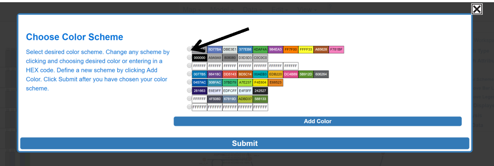
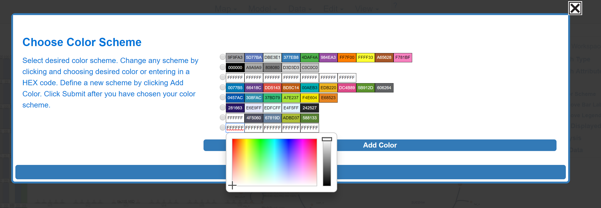
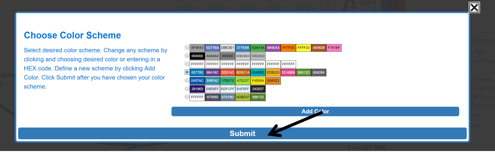
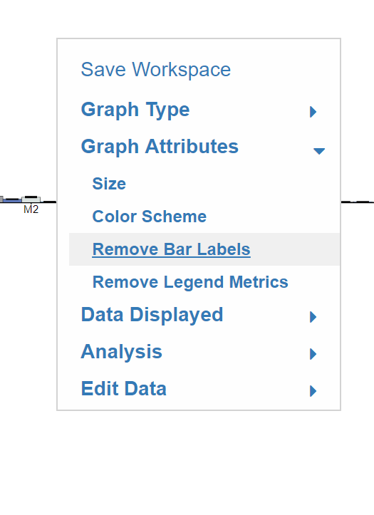
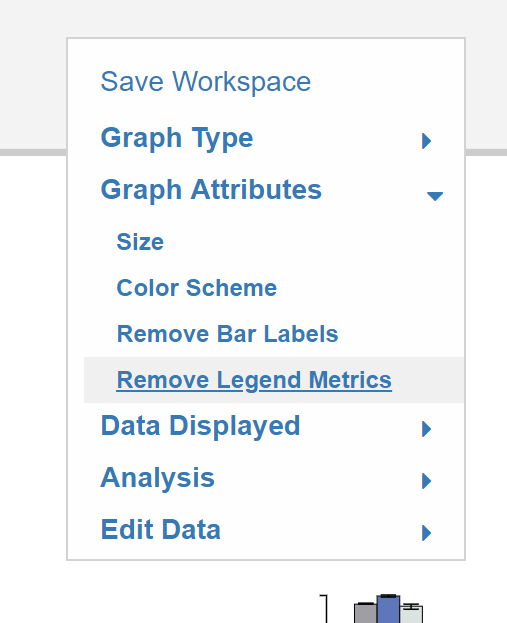

# <h2>4. Changing Graph Attributes</h2>
This portion of the guide will explain how to change the attributes of graphs including size and color.

## <h3>4.1 Changing Graph Size</h3>
This portion will explain how to change the size of all the graphs.

### <h3>4.1.0 Making Graph Size Pop-up Appear</h3>
After opening the Graph Attributes options, hover over Graph Size and left click.

While Hovering:

{: style='width:200px' }

After Click:

{: style='width:350px' }
 
To exit simply left click on the X in the top right

### <h3>4.1.1 Change Height</h3>
Change the graph height by left clicking and dragging the gray circle slider underneath "Height". Moving the slider to the right will make the dimension larger, moving left will make it smaller.

{: style='width:350px' }
 
### <h3>4.1.2 Change Width</h3>
Change the graph width by left clicking and dragging the gray circle slider underneath "Width". Moving the slider to the right will make the dimension larger, moving left will make it smaller.

{: style='width:350px' }
 
## <h3>4.2 Changing Graph Color Scheme</h3>
This portion of the guide will explain how to change the color scheme of all Escher Trace graphs.

### <h3>4.2.0 Making Color Scheme Pop-up Appear</h3>
After opening the Graph Attributes options, hover over Color Scheme and left click.

While Hovering:

{: style='width:200px' }
 
After Click:

 
### <h3>4.2.1 Selecting the Graph Color Scheme</h3>
Simply click on the white circle next to the desired color scheme.

 
### <h3>4.2.2 Create a Custom Color Scheme</h3>
Click in any of the boxes and another menu will appear, if you do not want to remove one of the current options click on Add Color to generate a completely new scheme.

 
Simply click on the color that you desire to include in your scheme to select it, alternatively you can enter HEX color codes to select colors.

 
When you are done choosing colors to add to your scheme, select the color scheme by clicking on the circle located to the left of the scheme.
 
 
 
### <h3>4.2.3 Submit or Abort Color Scheme</h3>
Hover over and left click submit to submit color scheme. Abort by clicking the X in the top right.

Before Submit: 

{: style='width:500px' }
 
Submit: 
 

 
After Submit:

{: style='width:500px' }
 
Abort:
 
  
 
## <h3>4.4 Remove/Add Bar Labels</h3>
This button removes the labels above the bar graphs and then puts the labels back on with a second click.

Before Click:

{: style='width:250px' }

After Click:

{: style='width:250px' }
 
Simply hover over and left click Remove Bar Labels to toggle options.

{: style='width:200px' }
 
## <h3>4.5 Remove/Add Legend Metrics</h3>
This button removes the legend metrics and then adds them back on the second click.

Before Click:

{: style='width:650px' }
 
After Click: 

{: style='width:600px' }
 
To toggle the legend metrics simply hover over and left click Remove Legend Metrics.

{: style='width:200px' }
