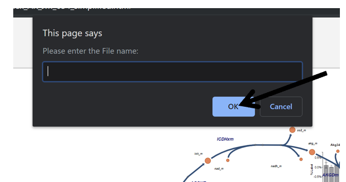

# 8. Save Workspace
This section will explain how to save your current Escher Trace workspace.

NOTE: The Escher Trace JSON data file that is generated by saving your workspace only includes information relating to your metabolite data and graphs, if changes were made to the Escher Map, it will need to be saved and reuploaded to completely separately to recreate your Escher and Escher Trace workspace. Information on how to save and reupload an Escher map can be found [here.](https://escher.readthedocs.io/en/latest/getting_started.html#loading-and-saving-maps)
 
## <h3>8.1 Make Option Appear</h3>
Hover over and left click on Save Workspace:

After Click:

{: style='width:500px' }

## <h3>8.2 Choose Filename</h3>
Type the desired filename into pop-up message and left click OK.

{: style='width:500px' }
 
After Click: A file with the entered name will be downloaded to your device. 

## <h3>8.3 Reupload Escher Trace Workspace</h3>
To reupload your Escher Trace workspace, after reopening Escher Trace and clicking "Import Tracing Data" as described [here](../GettingStarted#14-importing-tracer-data), and upload the downloaded JSON file.